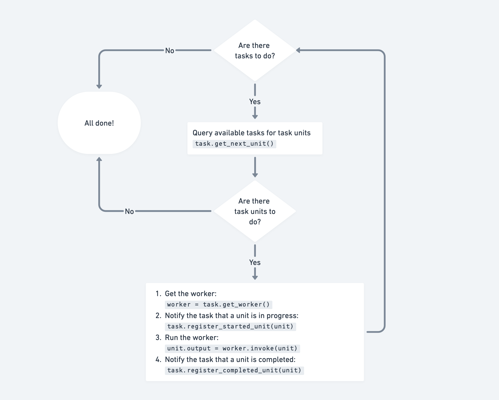

Key Concepts and API
====================

This is an overview of motleycrew's key concepts.

If you want to see them in action, see our `research agent example <examples/research_agent.html>`_.

For a basic introduction, you can check out the `quickstart <quickstart.html>`_.

Crew and knowledge graph
------------------------

The crew (:class:`motleycrew.crew.crew.MotleyCrew`) is a central concept in motleycrew. It is the orchestrator that knows what tasks sould be done in which order,
and manages the execution of those tasks.

The crew has an underlying knowledge graph, in which it stores all information relevant to the execution of the tasks.
Besides storing the tasks themselves, the knowledge graph can act as a universal storage for any kind of context
that is relevant to the tasks. You can find more info on how to use the knowledge graph in the `tutorial <knowledge_graph.html>`_.

We currently use `Kùzu <https://kuzudb.com/>`_  as a knowledge graph backend because it's embeddable,
available under an MIT license, and is one of the LlamaIndex-supported KG backends -
please raise an issue on GitHub if you'd like us to support others.

The relationships between tasks are automatically stored in the KG backend; but the agents that are working
on the tasks can also read and write any other context they want to share.

.. code-block:: python

    from motleycrew import MotleyCrew

    crew = MotleyCrew()
    crew.graph_store
    # MotleyKuzuGraphStore(path=/path/to/kuzu_db)

If you want to persist the data or otherwise customize the graph store, you can pass a graph store instance to the crew.

.. code-block:: python

    import kuzu
    from motleycrew.storage import MotleyKuzuGraphStore

    database = kuzu.Database(database_path="kuzu_db")
    graph_store = MotleyKuzuGraphStore(database=database)
    crew = MotleyCrew(graph_store=graph_store)

Tasks, task units, and workers
------------------------------

In motleycrew, a **task** is a body of work that is carried out according to certain rules. The task provides the crew
with a description of what needs to be done in the form of **task units**, and who must do it - that's called a
**worker**. A worker can be an agent, a tool, or for that matter any Runnable (in the Langchain sense).

The worker receives a task unit as an input, processes it, and returns a result.

In a simple case, a task will have a single task unit, and becomes completed as soon as the unit is done.
For such cases, motleycrew provides a `SimpleTask` class, which basically contains an agent and a prompt.
Refer to the `blog with images <examples/blog_with_images.html>`_ example for a more elaborate illustration.

.. code-block:: python

    from motleycrew.tasks import SimpleTask

    crew = MotleyCrew()
    agent = ...
    task = SimpleTask(crew=crew, agent=agent, name="example task", description="Do something")

    crew.run()
    print(task.output)

This task is basically a prompt ("Do something") that is fed to the provided agent. The task will be completed as
soon as the agent finishes processing the only task unit.

For describing more complex tasks, you should subclass the `Task` class. It has two abstract
methods that you should implement: ``get_next_unit`` and ``get_worker``, as well as some optional methods
that you can override to customize the task's behavior.

#. ``get_next_unit()`` should return the next task unit to be processed. If there are no units to do at the moment, it should return `None`.
#. ``get_worker()`` should return the worker (typically an agent) that will process the task's units.
#. `optional` ``on_unit_dispatch(unit)`` is called by the crew when a task unit is dispatched.
#. `optional` ``on_unit_completion(unit)`` is called by the crew when a task unit is completed.

Task hierarchy
--------------

Tasks can be set to depend on other tasks, forming a directed acyclic graph. This is done by either calling a
task's ``set_upstream`` method or by using the ``>>`` operator. The crew will then make sure that the upstream
tasks are completed before starting the dependent task, and pass the former's output to the latter.

.. code-block:: python

    task1 = SimpleTask(crew=crew, agent=agent, name="first task", description="Do something")
    task2 = SimpleTask(crew=crew, agent=agent, name="second task", description="Do something else")

    task1 >> task2
    crew.run()

How the crew handles tasks
--------------------------

The crew queries the tasks for task units and dispatches them in a loop. The crew will keep running until either all
tasks are completed or available tasks stop providing task units.

A task is considered completed when it has ``done`` attribute set to ``True``. For example, in the case of `SimpleTask`,
this happens when its only task unit is completed and the crew calls the task's ``on_unit_completion`` method.
In case of a custom task, this behavior is up to the task's implementation.

Available tasks are defined as tasks that have not been completed and have no incomplete
upstream tasks. On each iteration, available tasks are queried for task units one by one,
and the crew will dispatch the task unit to the worker that the task provides.

When a task unit is dispatched, the crew adds it to the knowledge graph and calls the task's ``on_unit_dispatch``
method. When the worker finishes processing the task unit, the crew calls the task's ``on_unit_completion`` method.

Now that you know the basics, we suggest you check out the `research agent example <examples/research_agent.html>`_
to see how it all works together.

Asynchronous execution
----------------------

Motleycrew supports asynchronous execution of task units. In this mode, the crew does not wait for the
completion of a task unit before searching for others. Instead, it searches and queues the task units
in an infinite loop till the queue is empty and no tasks are returning units.

Note that the dispatching process is always synchronous, so a task's ``get_next_unit`` method can be called only
after the previous unit is marked as pending and added to the knowledge graph and the execution queue.
So a task can generate new units based on what units have already been dispatched.

Motleycrew implements this behavior with 2 backends: ``asyncio`` and ``threading``. Feel free to make a feature request
if your needs call for some other backend.

.. code-block:: python

    from motleycrew.common import AsyncBackend
    crew = MotleyCrew(async_backend=AsyncBackend.ASYNCIO)  # or AsyncBackend.THREADING
    crew.run()

Also, you should specify if a task's units can be executed in parallel to each other, by providing
``allow_async_units=True`` to the ``__init__`` method of the ``Task`` class. Otherwise, this task's
units will be only run in parallel to other tasks' units.
